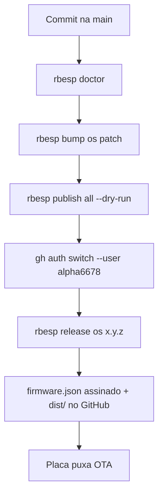

# Processo de release

Como publicar o **OS** RibanenseESP ou um **app da placa** no GitHub
(`alpha6678/RibanenseESP`).

## Convenções

- OS: tag `ribanense-esp-v<semver>`, asset `ribanense-esp-<ver>.bin` + `.sha256`.
- App: tag `esp-<slug>-v<semver>`, zip store `esp-<slug>-<ver>.zip` (`app.bin` + `app.json`).
- Branch-base: `main`.
- SemVer 2.0.

## Fonte de versão

O OS tem um único dono: [`firmware/ribanense-esp/version.json`](../firmware/ribanense-esp/version.json).
`rbesp bump os` altera esse arquivo (e o campo `version` de `firmware.json`).
O header C é gerado no compile. Não editar `ribanense_esp_version.h` à mão.

Apps: `firmware/apps/<Slug>/app.json` (`rbesp bump Sobre`).

## Fluxo



1. `rbesp doctor` — IDF, `gh` na alpha6678, chave em `secrets/`.
2. Bump ou `rbesp publish all --dry-run` para ver o plano.
3. `rbesp release os <semver>` (ou `rbesp os release <semver>`):
   - Compila o OS no espelho `C:\fw`
   - Cria a tag e o GitHub Release
   - Copia o `.bin` para `firmware/ribanense-esp/dist/`
   - Preenche `firmware.json` (`url`, `sha256`, `sig`) e faz push
4. App da placa: `rbesp release Sobre 0.1.3` atualiza `catalog/esp-catalog.json`.

`publish all` detecta mudança de código desde a última tag (OS:
`firmware/ribanense-esp/` + `firmware/esp-sdk/`, ignorando `firmware.json` e
`dist/`; app: pasta do app + sdk). Faz bump patch, commit das versões e
chama `release.ps1` por item. Não grava USB nem dispara OTA na LAN.

## Assinatura OTA

Payload canônico: `produto|versao|sha256` (ASCII).
Assinatura: ECDSA P-256 (DER em hex) com `secrets/ribanense-ota.pem`.
A placa verifica com a pubkey em
[`ribanense_ota_pubkey.h`](../firmware/esp-sdk/components/board/include/ribanense_ota_pubkey.h)
**antes** de baixar o binário.

```bat
rbesp keygen
rbesp sign
rbesp verify
```

Repositório público: qualquer um baixa o `.bin`; sem a privada ninguém
produz um `sig` que a placa aceite.

## Rollback

O bootloader tem `CONFIG_BOOTLOADER_APP_ROLLBACK_ENABLE`. A imagem só é
marcada válida ~30 s após a UI subir. Se o update travar no boot, a
próxima reinicialização volta ao slot anterior.

A placa que ainda aponta para o repositório antigo (`BananaSuisa`) **não**
enxerga releases novos. A primeira gravação desta linha é por USB
(`rbesp flash --primeiro`).

## Rate limits

`gh` autenticado. Sem token: 60 req/h na API pública.

## Ver também

- [`FERRAMENTAS_CLI.md`](FERRAMENTAS_CLI.md)
- [`FIRMWARE_RIBANENSEESP.md`](FIRMWARE_RIBANENSEESP.md)
